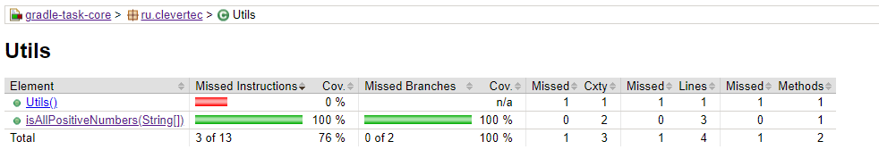

# Gradle task

## Основное задание
Находится в ветке main_task.
Для публикации jar файла и работы с ним в доп задании необходимо выполнить task publishToMavenLocal

## Дополнительное задание
Находится в ветке master

Скрины jacoco плагина:

